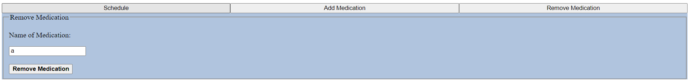

# Data Interactions
The purpose of Medication Monitor is to help patients and caretakers manage and keep track of their medications. To this end, the application will use data about a patient’s various medications such as the name and any other special instructions for consumption. Additionally, the application will also take time-based data such as the frequency of consumption for each medication, as well as the expiration and refill dates.

# Interface Description

Pictured above is the first version of the schedule. Once the user enters which medications they need to take and how often they need to take them each week, the schedule will be filled with medications for each day the user recorded. The user will also be able to click a checkbox next to each entry in the schedule to denote if they have taken the given medication for the day.

This is the first version of the add medication form. Users will be able to enter information about a single medication for the app to keep track of here. Once the add button at the button is pressed, the information will ultimately be saved to a backend database, and the new medication will appear on the schedule.

This is the first version of the remove medication form. Users will be able to enter a medication they wish to remove from their schedule here.

# Video Demonstration
https://www.loom.com/share/309227f9d3d64e8997008ed53be59297